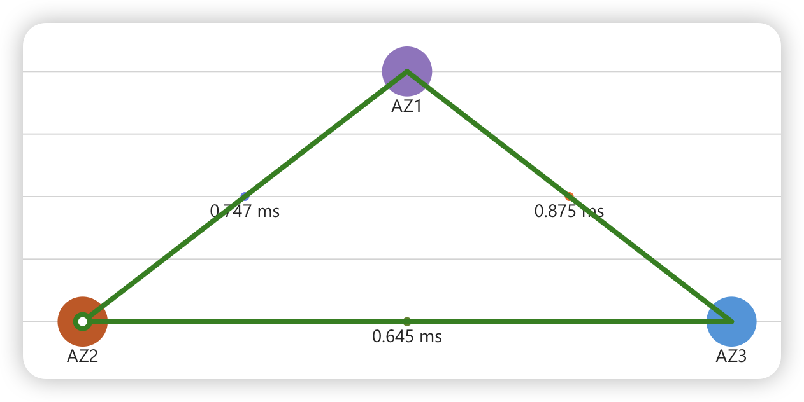
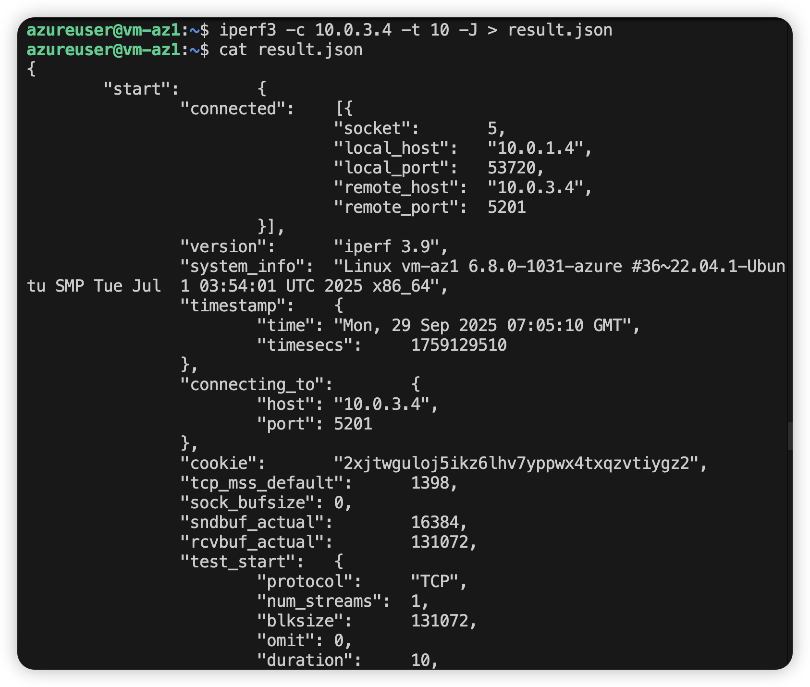
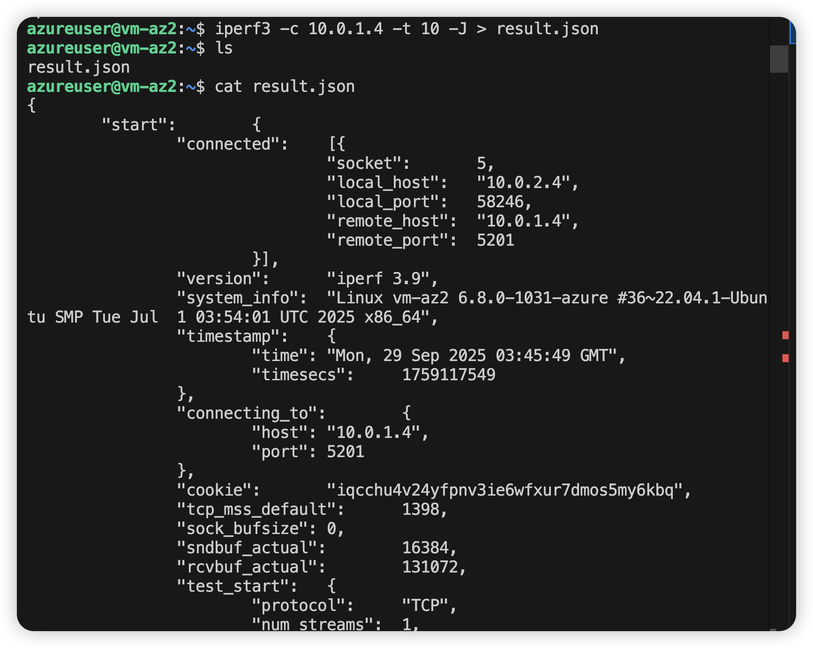
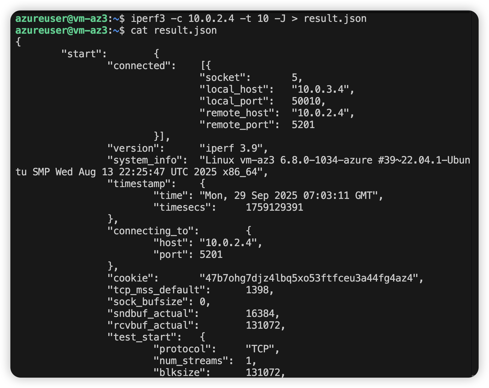
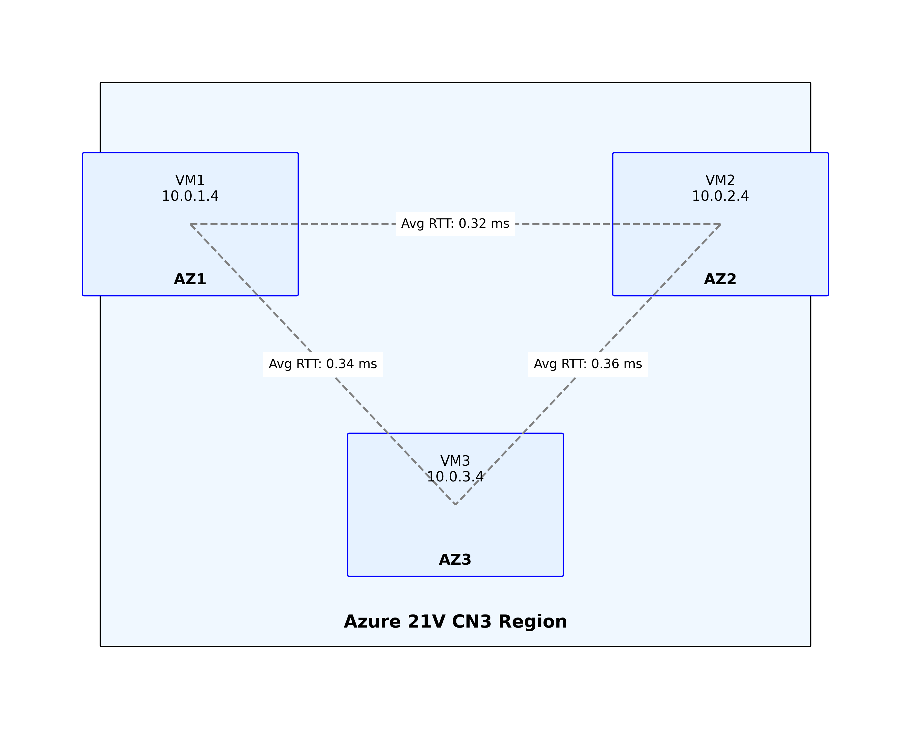
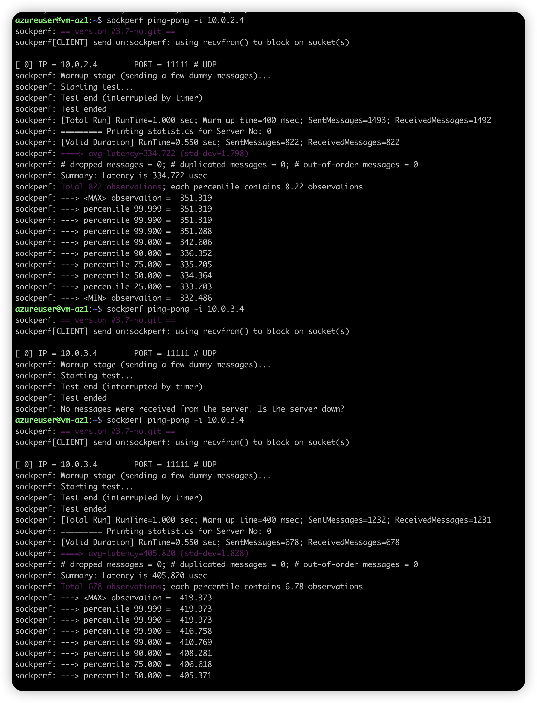
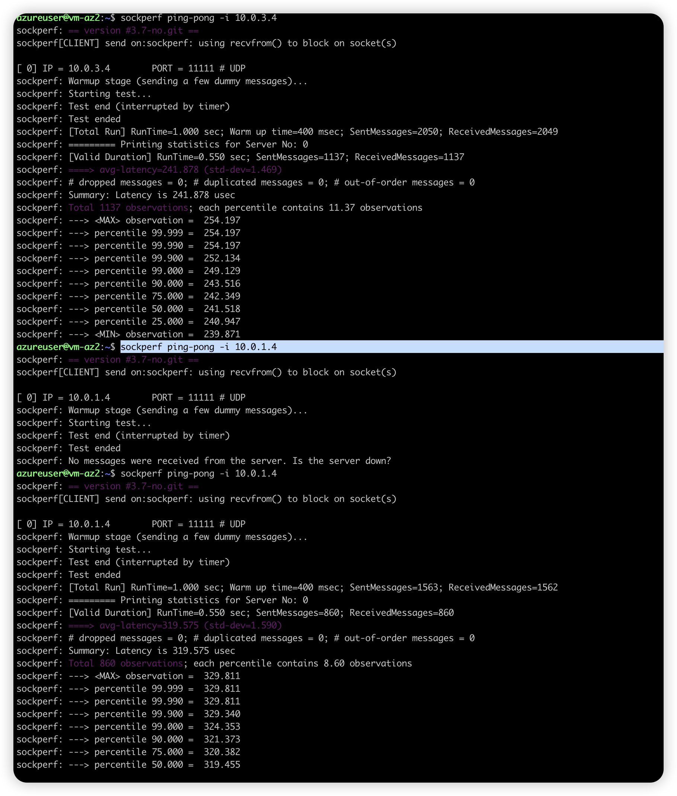
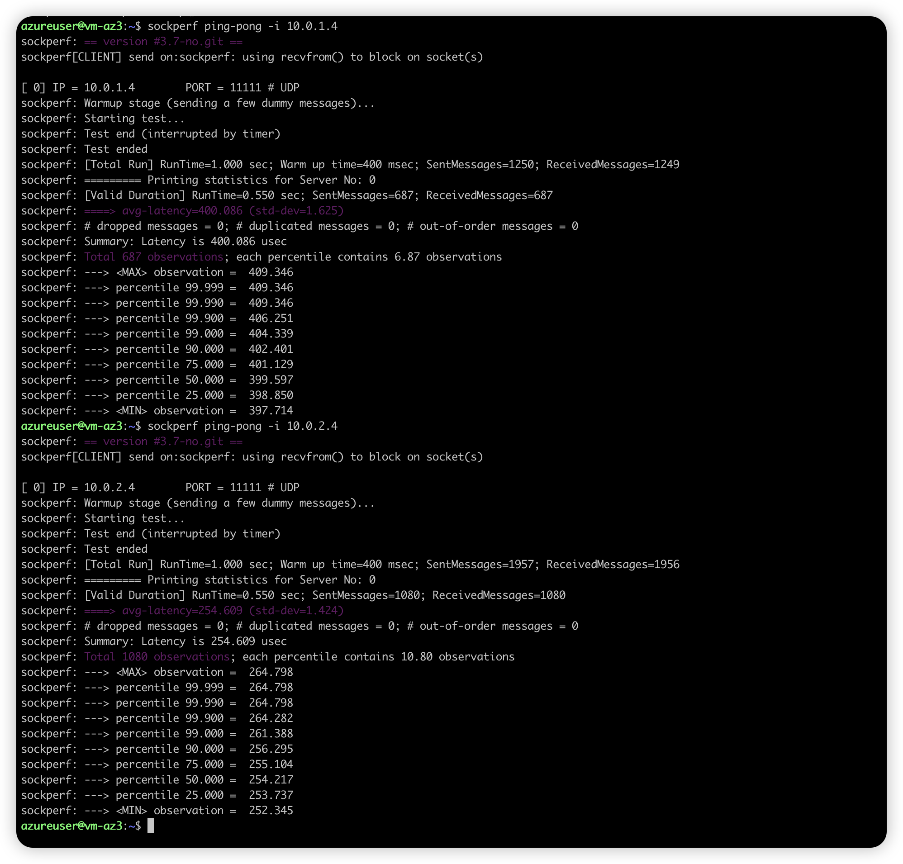

## Azure cn3 (北三) 三可用区 (AZ) 跨AZ VM 内网 RTT 测试报告

本报告涵盖在 Azure cn3（北三）region 的三个可用区（AZ1、AZ2、AZ3）中部署的虚拟机之间进行的网络延迟测试，包括 TCP 和 UDP 两种协议的测试结果。

### 测试环境与配置

- **区域**：Azure cn3 (北三)
- **VM 型号**：Standard D8ads v6 (8 vCPU, 32 GiB, 含网络加速)
- **部署配置**：
  - AZ1: VM1 - 私有 IP: `10.0.1.4`
  - AZ2: VM2 - 私有 IP: `10.0.2.4`
  - AZ3: VM3 - 私有 IP: `10.0.3.4`
- **网络**：VNet Peering 已配置，使用 VNet 内网进行互联通信

---

## TCP 延迟测试（iperf3）

### 测试方法

使用 iperf3 工具进行 TCP 层延迟测试，测量各 AZ 之间的网络 RTT。

### 测试结果

下面是针对 Azure cn3（北三）三个可用区（AZ1、AZ2、AZ3）之间使用 iperf3 进行的 TCP 延迟（RTT）测试结果。数值为单向 RTT，单位为毫秒（ms）：
*TCP 延迟测试结果图表，展示各 AZ 之间使用 iperf3 测试的网络延迟情况*
| 源 AZ | 目标 AZ | TCP RTT (ms) |
|:---:|:---:|:---:|
| AZ1 | AZ2 | 0.759 |
| AZ1 | AZ3 | 0.870 |
| AZ2 | AZ1 | 0.735 |
| AZ2 | AZ3 | 0.588 |
| AZ3 | AZ1 | 0.879 |
| AZ3 | AZ2 | 0.702 |




### TCP 测试过程截图


*以下截图展示在各 AZ VM 上使用 iperf3 进行 TCP 延迟测试的直观过程，并未完整显示测试数据*








### TCP 测试分析

- **最低延迟路径**：AZ2 → AZ3 (0.588 ms)，显示该路径延迟最低
- **最高延迟路径**：AZ3 → AZ1 (0.879 ms)，可能受 AZ 间网络跃点、路由或物理位置影响
- **方向性差异**：观察到双向路径存在延迟差异，如 AZ1 ↔ AZ2 路径（0.759 ms vs 0.735 ms）
- **测试工具**：iperf3（用于 TCP 层测试，记录的 RTT 为测试中取得的参考值）

---

## UDP 延迟测试（sockperf）

### 测试方法

使用 sockperf 工具进行 UDP 层延迟测试，在目标 VM 上运行 sockperf server，在源 VM 上运行 sockperf ping 测试若干次，收集 RTT 分位数与统计量（avg/min/max/p50/p90/p99）。

### 测试结果（单位：毫秒 ms）

| 源 → 目标 | 平均 (avg) | 最小 (min) | 最大 (max) | P50 | P90 | P99 |
|---:|---:|---:|---:|---:|---:|---:|
| AZ3 → AZ1 | 0.409 | 0.398 | 0.409 | 0.400 | 0.402 | 0.409 |
| AZ3 → AZ2 | 0.255 | 0.252 | 0.265 | 0.255 | 0.265 | 0.265 |
| AZ1 → AZ2 | 0.335 | 0.332 | 0.351 | 0.335 | 0.351 | 0.351 |
| AZ1 → AZ3 | 0.408 | 0.405 | 0.420 | 0.405 | 0.420 | 0.420 |
| AZ2 → AZ3 | 0.242 | 0.240 | 0.254 | 0.241 | 0.254 | 0.254 |
| AZ2 → AZ1 | 0.320 | 0.319 | 0.330 | 0.320 | 0.330 | 0.330 |

### UDP 测试网络拓扑图



*图中展示了 AZ1/2/3 的 VM 互联和所属私有 IP，便于理解 UDP 测试路径。*

### UDP 测试过程截图







*以上截图展示在各 AZ VM 上使用 sockperf 进行 UDP 延迟测试的过程*

### UDP 测试分析与结论
- **整体观察**：跨 AZ 的 UDP RTT 存在明显差异，且方向性有关（例如 AZ2 ↔ AZ3 路径明显低于 AZ1 ↔ AZ3 路径）
- **最低延迟路径**：AZ2 → AZ3 平均约 0.242 ms，P99 0.254 ms，显示该路径较稳定且延迟较低
- **最高延迟路径**：AZ3 ↔ AZ1 平均约 0.408 ms，P99 0.409–0.420 ms，明显高于其他路径，可能受 AZ 间网络跃点、路由或物理位置影响
- **双向差异**：同一路径的反向 RTT（例如 AZ3 → AZ1 与 AZ1 → AZ3）非常接近，但仍存在小幅差值（0.409 vs 0.408），总体一致性良好

### 测试命令示例

```bash
# 在目标 VM 上运行 server
sockperf server &

# 在源 VM 上运行 ping（示例）
sockperf ping-pong --ip 10.0.3.4 --time 10
```

---

## 综合分析与建议

### 可能原因（需进一步验证）

- AZ 的物理拓扑或边缘路由不同导致的额外跃点
- 路由策略、网络加速/NIC 分配或超额认购导致的差异
- VNet Peering 跨子网或跨虚拟网络的实现差异

### 建议的后续验证步骤

1. 在相同时间窗口内重复多轮测试以验证一致性（不同时间段/不同负载）
2. 使用 tcpdump 或 Azure 网络监控工具抓包，定位是否存在中间跃点或重传
3. 检查 NSG、UDR、路由表和负载均衡器配置，确认没有意外的路径偏移
4. 尝试不同 VM SKU（有/无网络加速）比较差异

---

## 免责声明

此次测试结果仅基于作者在特定时间点、特定 Azure cn3（北三）region 配置和 VM SKU 下的测试环境与方法。测试数据仅供参考，不代表 Microsoft/Azure 官方的性能或网络质量测量结果。若需要官方基准或正式验证，请联系 Azure 支持或使用 Microsoft 提供的标准化测试工具与方法。
